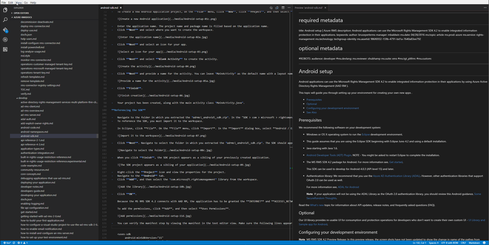

# markdown-authoring

## Install
Launch [vscode][vscode-download-link], quick open(ctrl+p on windows, ⌘+p on mac), run "ext install markdown-authoring". Please note to enable it.

## Features

### Relative reference link validation

* Auto-diagnostic when load extension and command(alt+l) support - show invalid relative reference links as severity warnings for all markdown files in workspace. 
* Auto-track when edit - also diagnostic for editing markdown files.
* Intellegence - auto-detect and provide suggestions with valid relative reference link options when edit.

## Demo

## Follow-up

Other features to improve markdown authoring.

## About

* [markdown-authoring extension in vs marketplace][markdown-authoring-download-link]

## License

[MIT](LICENSE.txt)

[vscode-download-link]: https://code.visualstudio.com/download
[vscode-extension-development-link]: https://code.visualstudio.com/docs/extensions/overview
[markdown-syntax-link]: https://daringfireball.net/projects/markdown/syntax
[markdown-authoring-download-link]: https://marketplace.visualstudio.com/items?itemName=yanz.markdown-authoring

